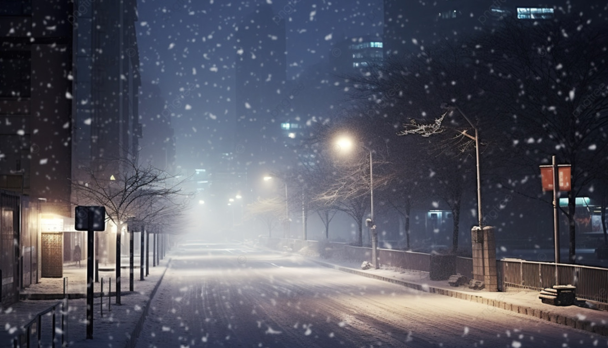
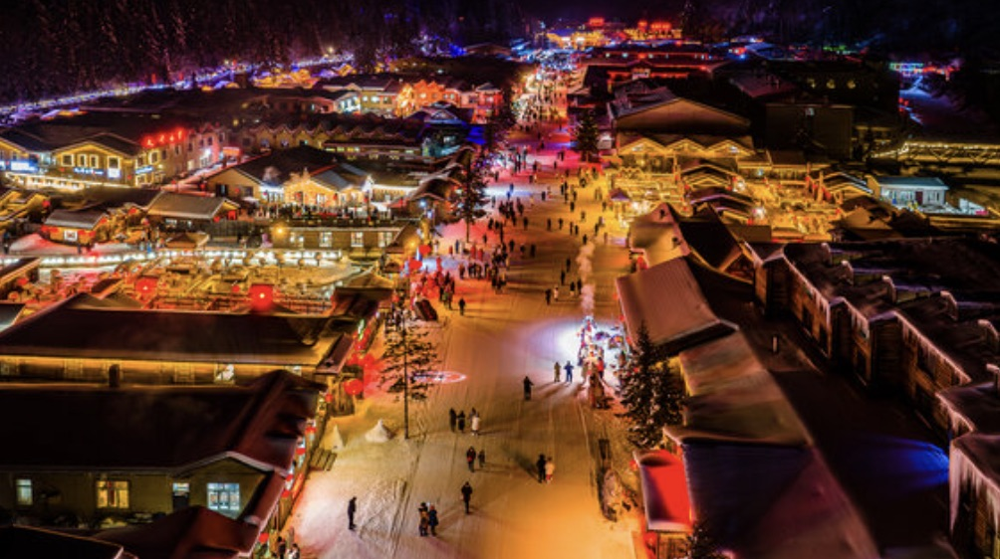

# IDEA9103-Major-Project
## Functioning prototype
### Instructions on how to interact with the work
- Interaction 1:
  - Press "Move Cars" button below the screen to move the cars;
  - Press again to stop the cars.
- Interaction 2:
  - Press " "(space) on key board to change the red and blue lights.
- Interaction 3:
  - Press "1" on key board to see the night view of the street with falliing snows.
### Details of individual approach to animating the group code
- The animation method I chosed to drive this individual code:
  - User Input: Incorporate mouse or keyboard inputs for animation.
- Which properties of the image will be animated and how：

  1.**Background Color Change**:
  When the '1' key is pressed, the background color of the canvas changes from a light color to a deep blue, simulating a transition from day to night.

  2.**Snowflake Animation**:
  Upon pressing the '1' key, snowflakes begin to fall from the top of the canvas to the bottom. This animation involves the creation and continuous movement of multiple small white circles representing snowflakes.

  3.**Car Movement**:
  When the "Move Cars" button is pressed, the cars (represented by rectangles) move vertically across the canvas. This creates a dynamic scene where cars continuously loop from the bottom to the top once they reach the end of the canvas.

  4.**Light Color Swap**:
  Pressing the spacebar swaps the colors of the lights (red and blue rectangles) on the canvas. This toggling effect is repeated every time the spacebar is pressed, adding a layer of interactivity and visual variation.

- References to inspiration for animating your individual code:
  - Figure 1: the snowy driveway at night
  
  reference:https://images.app.goo.gl/ZcgoNB7HhWhfRoXY8

  - Figure 2: the night scene with red and blue lights
  
  reference:https://images.app.goo.gl/K3bc8qrzDnstngQR9

 #### Uniqueness from Other Group Members' Work :
- Background and Snowflake Interaction:
The background color change and the introduction of falling snowflakes upon pressing the '1' key are unique to this part of the project. This simulates weather changes and enhances the atmospheric dynamics, differentiating it from the other members' work that focuses on perlin noise and randomness for city transitions.

- Car Movement:
The vertical movement of cars on the canvas provides a visual representation of traffic flow and urban activity, adding a dynamic and realistic element to the scene. This continuous motion contrasts with the randomness and perlin noise animations used by another member, offering a different type of animated interaction.

- Interactive Light Color Swap:
The ability to swap light colors with the spacebar introduces an element of user control and interaction, making the scene more engaging. This specific color change mechanism adds a distinct visual variation that is not present in the other animations focused on randomness and perlin noise.

